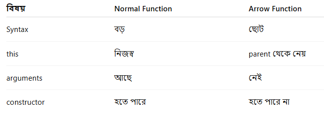

# Chapter-11 || ES6

## what is ES6
ES6 is the 6th version of ECMAScript.It was released in 2015

## Template string
A template string (also called template literal) is a modern javascript feature introduce in ES6(2015).It lets you create more string clearly and easily.

```js
template literal
`Hello`
```
## Example
```js
const title = "This is title";
const body = "This is a body";
const div = `<div>
    <h1>${title}</h1>
    <p>${body}</p>

</div>`;
console.log(div);
```
## Arrow function 
arrow function is a modern javascript feature introduce  in ES6(2015).It is a shorter form of a function expression.

```js
syntax
() => {};

```
Then, many way declare arrow function.

## Example
```js
const value = (a, b) =>  a + b;
console.log(value(10, 20)); // 30

```
## Normal function Vs Arrow function
;