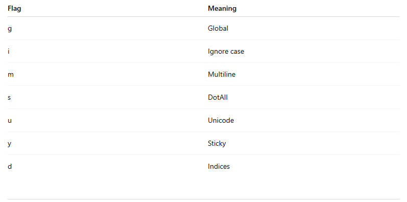

# Chapter-16 || Constructor

## Constructor 
Constructor is a function that create a  new object
Constructor means construct or built in object.
There are many types of constructor..

## Number Constructor
Number constructor used to convert string to number.Whole string must be numeric.Otherwise NaN.

### example
```js
const strNum = '42';
const num = Number(strNum);
console.log(num);//42
console.log(typeof num); //number

const strNum2 = 'String';
const num2 = Number(strNum2);
console.log(num2);//NaN

//another way string convert to number
const str = '591';
const num = +str;
console.log(num);
```

## String Constructor
String Constructor used to convert number to string.

### example
```js
const num = 123;
const str = String(num);
console.log(str);//123
console.log(typeof str); //string

//another way number convert to string
const num2  = 123;
const str2 = num2 + '';
console.log(str2); //123
console.log(typeof str2); //string
```

## Boolean Constructor
Boolean Constructor used to check value is true or false.

### example
```js
const isTruthy = Boolean(1);
console.log(isTruthy);//true

const isFalse = Boolean(-0);
console.log(isFalse);//false

const checkValue = Boolean(-1);
console.log(checkValue);//true

const checkValue2 = Boolean(0);
console.log(checkValue2);//false;

const checkValue3 = Boolean('');
console.log(checkValue3);//false;
```

## Function Constructor
Use Function Constructor we are create dynamic function.Function Constructor is lazy.

### example
```js
const add = new Function('a , b', 'return a + b');
console.log(add(10, 20));//30

const even = new Function(
  'a, b',
  'if(a % b === 0){console.log("even")}else{console.log("odd")}'

)
even(11, 2);//odd

const even1 = (a, b) => {
  if(a % b === 0){
    return 'even';
  }else{
    return 'false';

  }
}
console.log(even1(10, 2)); //even
```

## Object Constructor
We are define object, use Object Constructor.It is old way to define object

### example
```js
const  obj = new Object();
obj.name = 'jobayer';
obj.age = 19;
obj.email = 'jobayerjoban0048@gmail.com';
console.log(obj);//{ name: 'jobayer', age: 19, email: 'jobayerjoban0048@gmail.com' }
```

## Math
Math have a js built in Object. It's have many methods

## Math.min()
Math.min() find out minimum number in number store.

### example
```js
const min = Math.min(10, 20, 30, 40, 50, 60);
console.log(min);//10

const min2 = Math.min(-9, 1, 2, 3, 4, 5, 6);
console.log(min2);//-9
```

## Math.PI()
Math.PI() given value of PI

## example
```js
const pi = Math.PI;
console.log(pi);//3.141592653589793
```

## Math.abs()
Math.abs() given absolute value of number. given positive number.

### example
```js
const abs = Math.abs(-7);
console.log(abs);//7

const abs2 = Math.abs(7.55);
console.log(abs2);//7.55
```

## Math.round()
Math.round() floating number convert their near integer number.

### example
```js
const round = Math.round(19.6);
console.log(round);//20

const round2 = Math.round(20.5);
console.log(round2);//21
```

## Math.floor()
Math.floor() floating number convert real integer Number.

### example
```js
const floor = Math.floor(10.3);
console.log(floor);//10

const floor2 = Math.floor(11.5);
console.log(floor2);//11
```

## Math.ceil()
Math.ceil() floating number convert upper real integer number.

### example
```js
const ceil = Math.ceil(10.2);
console.log(ceil);//11

const ceil2 = Math.ceil(11.1);
console.log(ceil2);//12

const ceil3 = Math.ceil(12.5);
console.log(ceil3);//13
```

## Math.random()
Math.random() give a unique number.

### example
```js
const random = Math.random();
console.log(random);//0.5558105086313145

const random2 = Math.random();
console.log(random2);//0.8190647450326545
```

## Date js built in Object
Date() is js built in Object.It easily find out current date and time.There are many methods in this object.
- getFullYear() - to get Year
- getMonth() - to get Month (0 - 11)
- getDate() - to get Date (1 - 31)
- getDay() - to get Day (0 - 6)
- getMinutes - to get Hours (0 - 23)
- getSeconds - to get Seconds

## set specific 
- setFullYear() - set specific Year
- setMonth() - set specific Month
- setDate() - set specific Date
- setHours() - set specific Honours
- setMinutes() - set specific Minutes
- setSeconds() - set specific Seconds
## Those are gives more parameter
```js
date.setHours(hour, minute, second, millisecond);
```
### example
```js
const date = new Date();
console.log(date);//2026-02-20T06:06:46.479Z
```

## Different two dates
```js
const date = new Date('2028-11-01');
const date2 = new Date('2029-02-16');
const diff = date2 - date;
const calculationDate = diff/(1000 * 60 * 60 * 24);
console.log('days:', calculationDate);//days: 107
```

## Date.now()
Date.now() given 1970 to now milliseconds.
```js
const now = Date.now()
console.log(now);//1771568658996
```

## Regular Expression or RegEx
Regular Expression is pattern matching system.We are  define two ways RegEx.
```js 
const pattern = /apple/
const pattern = new RegExp("apple");
```
### example
```js
const sentence = 'I have a apple';
const pattern = /apple/
console.log(pattern.test(sentence));//true

const sentence = "I have a apple. apple is good";
const replace = sentence.replace(/apple/g, 'banana');
console.log(replace);//I have a banana. banana is good
```
## RegEx flags


## general RegEx pattern
- ./ - any character
- \d - any digit(0 - 9)
- /w - any word, character(a-z, A-Z, 0-9,_ +)
- /s - space
- plus(+) - any patten have one or more
- star(*) - pattern 0 or more
- ^ - start text
- $ - End text


## Email and Mobile number validation
```js
const email = 'jobayerjoban0048@gmail.com';
const pattern = /^[\w]+@[\w]+\.[\w]{2,}$/;
console.log(pattern.test(email)); //true

const number = '01712345678';
const pattern2 = /^01[3-9]\d{8}$/;
console.log(pattern2.test(number));//true
```

## Set
variable store special way is Set.It's store unique value. doesn't store same value.Set between array some difference.

### example
```js
const set = new Set([1, 2, 3, 4, 5, 6]);
console.log(set); //Set(6) { 1, 2, 3, 4, 5, 6 }

const number = [1, 3, 3, 5, 6, 7];
const mySet = new Set(number);
console.log(mySet);//Set(5) { 1, 3, 5, 6, 7 }

const mySet = new Set();
mySet.add(10);
mySet.add(20);
console.log(mySet);//Set(2) { 10, 20 }
console.log(mySet.has(20));//true
mySet.delete(10);
console.log(mySet);//Set(1) { 20 }

```

## Array vs Set 
- Array can store duplicate value.but Set cannot store duplicate value
- Array access way index.but Set access way value
- efficiency: big data task Set fast.But Array depend loop

## Map
Map is store kay-value-pair data.It's works as a object.but Map gives most advantage.

###  example
```js
const myMap = new Map();
myMap.set('name', 'Rahim');
myMap.set('age', 25);
console.log(myMap);//Map(2) { 'name' => 'Rahim', 'age' => 25 }

const size = myMap.size;
console.log(size); //2

const name = myMap.get('name');
console.log(name);//Rahim
```
